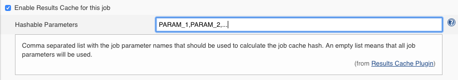

Results Cache Plugin
====================
This plugin allows for avoiding the execution of the same job with the same parameters more than once in order to save resources and time.
To identify every job it uses a hash identifier which is composed by the Jenkins master URL, the full job name (including the folder) and the selected parameters with their values (selected in the job configuration).
It works using a complementary external Cache Service which has to implement the following REST API:

Cache Server API
----------------
* GET /job-results/{hash}: Returns a cached result from its job hash. Returns 'NOT_BUILT' if the job hash is not found.
* POST /job-results/{hash}/{result}: Adds a new result in the cache for the provided job hash
* DELETE /job-results/clear: Removes all the cache values

You can find a reference implementation in [results cache service](https://github.com/king/results-cache-service) or implement it on your own.

Requirements
============
Jenkins
-------
Jenkins [version 2.19](https://jenkins.io/changelog#v2.19) or newer is required.

Setup
=====
Install plugin
--------------
Install this plugin via the Jenkins plugin manager.

Configure plugin
----------------
Go to Manage Jenkins → Configure System and set up the URL of the Cache Service API mentioned above and the communication timeout with that service.

If this URL is not defined or the connection timeout occurs then the jobs will be considered as not executed before and they will work as if no cache was configured for them.


Per-job configuration
=====================
Job configuration
-----------------
You can enable a job to cache its result in the Cache Service. To do that you have to enable the option Enable Results Cache for this job in the Configure page of the job.

The Cache Service will contain the latest result of every job using a hash value that identifies every execution of the job.

A hash value is calculated using the following data of the job execution:

* Jenkins master machine name (optional): this value can be excluded from the hash calculation enabling the option Exclude Jenkins Machine Name.
* Full job name (including the folder)
* Job execution parameter names and values (configurable): you can specify which parameters names and values will be part of the hash calculation in the option Hashable Parameters (comma-separated list of the job parameter names). If this option is left blank then all the job parameters will be used.



Job DSL configuration
---------------------
You can enable the results cache plugin in your jenkins jobs using Job DSL. You only need to configure it in the `wrappers` section of your dsl.

```
resultsCache(boolean excludeMachineName, String hashableProperties)
```

Example:
```
wrappers {
    resultsCache(true, 'PARAM_1, PARAM_2')
}
```

###### Note: like above if you provide an empty list that means all job parameters will be used.

Latest release
==============
1.3.1

How to build
============
```mvn hpi:hpi```

Version history
===============
Version 1.3.1 (July 9, 2021)
---------------------------
* Every cached result now also contains build number
* New `CACHED_RESULT_BUILD_NUM` environment variable created for runs where cached result returned successful

Version 1.2.0 (May 8, 2019)
---------------------------
* Initial release

Contact us!
===========
The original King authors of this code:

 - Francisco Javier García Orduña (francisco.orduna@king.com)
 - David Campos Valls (david.campos@king.com)

With any questions or suggestions feel free to reach out to us an email anytime!
